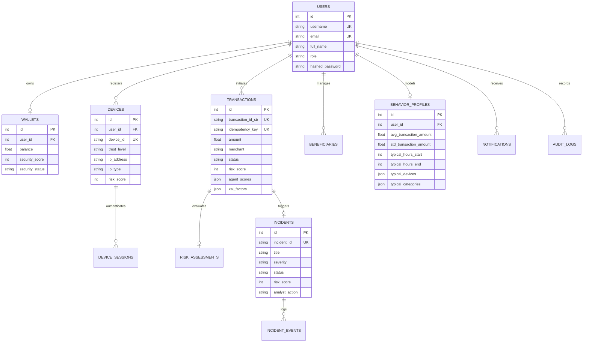

# 🗄️ Database Architecture — NexGuard Secure Wallet

NexGuard uses SQLAlchemy 2 with PostgreSQL (production / Docker) and SQLite (quick local development).

---

## 1. Entity-Relationship Schema

---

## 2. Table Catalog

| Table | Purpose | Key Columns |
| :--- | :--- | :--- |
| `users` | Customer & SOC Analyst accounts | `username`, `email`, `role`, `hashed_password` |
| `wallets` | Synthetic balance & security score | `balance`, `security_score`, `security_status` |
| `devices` | Registered phone hardware & trust | `device_id`, `trust_level`, `ip_address`, `risk_score` |
| `device_sessions`| Active sessions & token bindings | `session_token`, `device_id`, `expires_at` |
| `transactions` | Payment ledger & 10-agent scores | `amount`, `status`, `risk_score`, `idempotency_key` |
| `beneficiaries` | Saved payees & mule indicators | `name`, `upi_id`, `trust_score`, `is_flagged` |
| `behavior_profiles` | Digital Twin behavioral baselines | `avg_transaction_amount`, `typical_hours` |
| `risk_assessments`| Detailed risk evaluation audit | `composite_score`, `agent_scores`, `xai_factors` |
| `incidents` | SOC incident tickets (INC-XXXX) | `incident_id`, `severity`, `status`, `analyst_action` |
| `incident_events`| Forensic incident timeline steps | `event_type`, `actor`, `description` |
| `threat_intelligence` | Synthetic IOCs & Tor exit nodes | `indicator`, `indicator_type`, `severity` |
| `notifications` | Real-time push security alerts | `title`, `message`, `notification_type`, `is_read` |
| `audit_logs` | Immutable audit trail | `actor_name`, `action`, `resource_id`, `description` |
| `cryptographic_assets`| NIST PQC asset inventory | `algorithm`, `pqc_ready`, `quantum_risk_level` |
| `security_policies` | Configurable weights & thresholds | `risk_allow_max`, `risk_verify_max`, `agent_weights` |
| `security_events` | Telemetry logs (failed logins) | `event_type`, `severity`, `device_id` |

---

## 3. Data Integrity & Ledger Guarantees

1. **Transaction Idempotency:** The `idempotency_key` column has a unique database index. Submitting an identical payment request twice returns the original result with zero duplicate debit.
2. **Tri-State Ledger Safety:**
   - `ALLOW:` Debits sender in the same atomic database transaction.
   - `VERIFY:` Funds held; ledger remains untouched until step-up biometric verification succeeds.
   - `BLOCK:` No balance change; incident ticket created atomically.
3. **Immutable Audit Trail:** Actions (`LOGIN`, `TRANSACTION_BLOCKED`, `DEVICE_QUARANTINED`, `ANALYST_OVERRIDE`) append to `audit_logs` and are never updated or deleted.
